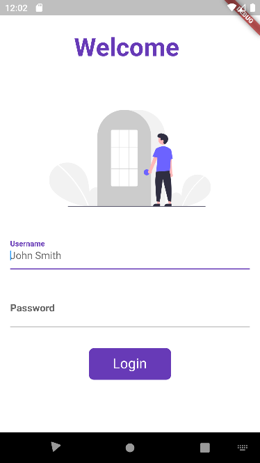
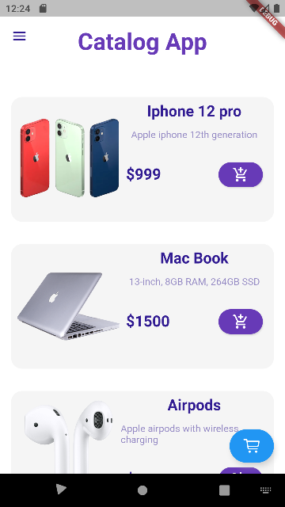

<h1>E-Commerce App using Flutter</h1>

<h2> My first Flutter Application.</h2>

My first flutter project is a mobile application for e commerce. My app has mainly three pages
 the first is login page
 the second is the main page of the app where you can see the list of items in a vertical manner
 the third is a description of each item which includes buy button and a add to cart button
 And finally a cart page where you can save your favourite items
 This app also works in dark mode.

<h2>Final UI of the app</h2>
<h3> The login page</h3>

<h3>Catalog List Page</h3>

